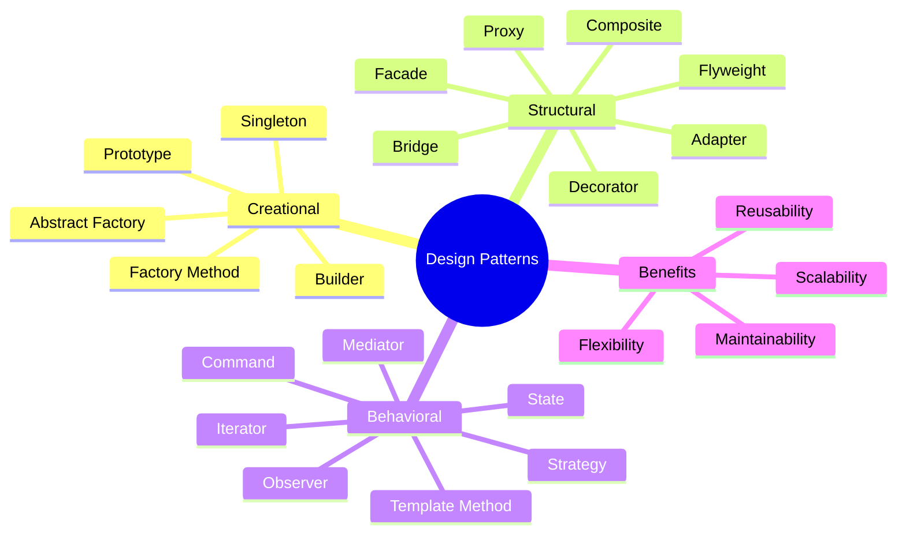
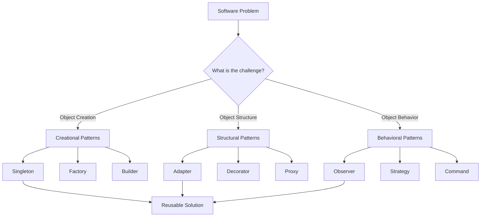

# **`Awesome`** [Design](https://wikipedia.org/wiki/Software_design_pattern) [Patterns](https://refactoring.guru/design-patterns)  

    
    &nbsp;
    
    &nbsp;
    
    

## 📖 Contents
- [Creational patterns](#creational-patterns)
    - [Singleton](#singleton)
    - [Factory Method](#factory-method)
- [Structural Patterns](#structural-patterns)
    - [Adapter](#adapter)
    - [Proxy](#proxy)
- [Behavioral Patterns](#behavioral-patterns)
    - [Chain of Responsibility](#chain-of-responsibility)
    - [Observer](#observer)
- [My Other Awesome Lists](#my-other-awesome-lists)
- [Contributing](#contributing)
- [Contributors](#contributors)

## Creational Patterns

### Singleton

### Factory Method

## Structural Patterns

### Adapter

### Proxy

## Behavioral Patterns

### Chain of Responsibility

### Observer

## 
### My Other Awesome Lists
You can access the my other awesome lists [here](https://cyberthreatdefence.com/my_awesome_lists)

### Contributing
[Contributions of any kind welcome, just follow the guidelines](contributing.md)!

### Contributors
[Thanks goes to these contributors](https://github.com/cybersecurity-dev/awesome-design-patterns/graphs/contributors)!

### License

[🔼 Back to top](#awesome-design-patterns-)
